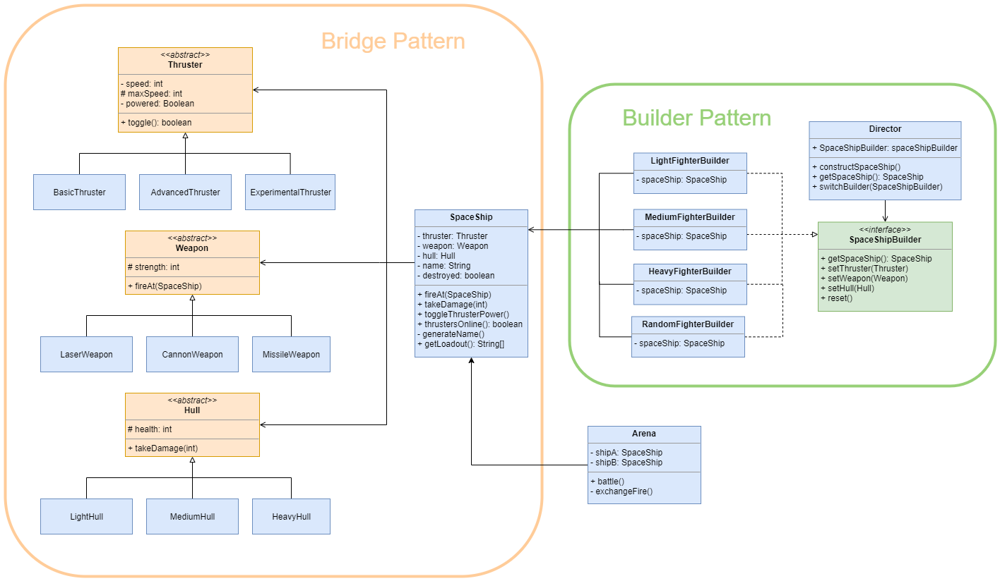

# Project Overview

## Submission Details

    Taylor Liss (tliss@bu.edu)
    CS665 Software Design and Patterns - Final Project
    Summer 2, 2021

# Design Goals


## General Description

For the final project, I chose to create an implementation of a computer game, where different Spaceships could be created and then fought against oneanother. I wanted to create ships that could be pieced together from different components and additionally wanted to have a means of automating the building of specific ships. To this end, I chose to implement the **Bridge Pattern** and the **Builder Pattern**.

## UML Diagram



## Implementation Description


# Project Template

This is a Java Maven Project Template


# How to compile the project

We use Apache Maven to compile and run this project. 

You need to install Apache Maven (https://maven.apache.org/)  on your system. 

Type on the command line: 

```bash
mvn clean compile
```

# How to create a binary runnable package 


```bash
mvn clean compile assembly:single
```


# How to run

```bash
mvn -q clean compile exec:java -Dexec.executable="edu.bu.met.cs665.Main" -Dlog4j.configuration="file:log4j.properties"
```

We recommand the above command for running the Main Java executable. 


# Run all the unit test classes.


```bash
mvn clean compile test checkstyle:check  spotbugs:check
```

# Using Spotbugs to find bugs in your project 

To see bug detail using the Findbugs GUI, use the following command "mvn findbugs:gui"

Or you can create a XML report by using  


```bash
mvn spotbugs:gui 
```

or 


```bash
mvn spotbugs:spotbugs
```


```bash
mvn spotbugs:check 
```

check goal runs analysis like spotbugs goal, and make the build failed if it found any bugs. 


For more info see 
https://spotbugs.readthedocs.io/en/latest/maven.html


SpotBugs https://spotbugs.github.io/ is the spiritual successor of FindBugs.


# Run Checkstyle 

CheckStyle code styling configuration files are in config/ directory. Maven checkstyle plugin is set to use google code style. 
You can change it to other styles like sun checkstyle. 

To analyze this example using CheckStyle run 

```bash
mvn checkstyle:check
```

This will generate a report in XML format


```bash
target/checkstyle-checker.xml
target/checkstyle-result.xml
```

and the following command will generate a report in HTML format that you can open it using a Web browser. 

```bash
mvn checkstyle:checkstyle
```

```bash
target/site/checkstyle.html
```


