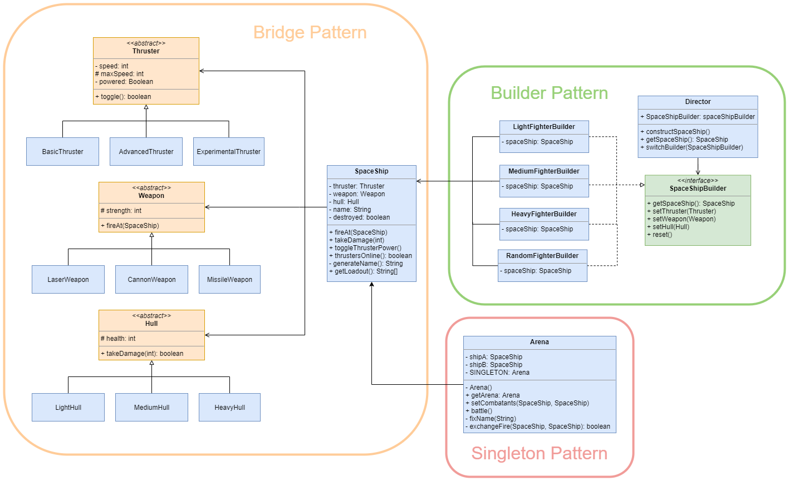

# Project Overview

## Submission Details

    Taylor Liss (tliss@bu.edu)
    CS665 Software Design and Patterns - Final Project
    Summer 2, 2021

# Design Goals


## General Description

For the final project, I chose to create an implementation of a computer game, where different Spaceships could be created and then fought against oneanother. I wanted to create ships that could be pieced together from different components and additionally wanted to have a means of automating the building of specific ships. To this end, I chose to implement the **Bridge Pattern** and the **Builder Pattern**.

## Special Notes

I wanted to generate a unique name for every `SpaceShip` object created. In order to do this, I used an external library called **Nomen est Omen** (https://github.com/igr/nomen-est-omen). In order to load it into my project, I had to use a special tool called **JitPack** (https://jitpack.io/). You can find both of these tools added to the end of my `pom.xml` file.

# Implementation Description

## UML Diagram



# Bridge Pattern

I started out by first determining what components a `SpaceShip` object should be composed of. I decided on three: a `thruster` component, a `weapon` component, and a `hull` component. Additionally, I wanted there to be different "tiers" for each component representing the components relative quality: a "low-tier", a "medium-tier", and a "high-tier". These 9 components could subsequently be combined into 27 different ships. In order to prevent the need to create 27 different classes for every possible combination, I chose instead to use the **Bridge Pattern**.

The `SpaceShip` object represents the *abstraction* part of the bridge pattern, while the three abstract classes represent the `implementation`. The different tiers of components that inherit from those abstract classes represent the `concrete implementations` in the pattern.

I wantedo to make each concrete implementation unique, so for the `Thrusters` I gave them a `speed` field. `Weapons` got a `strength` field and `Hulls` recieved a health field. My idea is that when two ships fight, whoever has the faster thrusters will attack first and deal damage to an opponents hull equal to their weapon's strength. When a ship's hull health reaches zero, the ship is considered "destroyed".

With this setup, I could now build a ship by creating new `Thruster`, `Weapon`, and `Hull` objects into the SpaceShip constructor. However, I still felt this method to be a tad clunky, and wanted an easier way to build pre-made ships instead of having to type out so many parameters. If I added more features to the `SpaceShip` class, the parameters required to instantiate a SpaceShip object could grow even longer and become unwieldy. For this reason, I decided to also implement the **Builder Pattern**.

# Builder Pattern

Creating the builder pattern first required me to create a *builder* interface which all of my *concrete builders* would implement. I called this interface `SpaceShipBuilder`. It requires that all classes which implement it, must implement methods for setting the `Thruster`, `Weapon`, and `Hull` objects. Additionally, they must all have a method for retrieving the ship after it has been built.

Using this interface, I created three main "Fighter" builders - one for each component tier. Additionally, I created a `RandomFighterBuilder` for fun. This builder would do two unique things: first it would build a new ship with a random assortment of components and second it would generate a random name for the ship using the **Nomen est Omen** library mentioned in the "Special Notes" section above.

Lastly, I needed to create a `Director` class which could take a builder and order them to build a ship. Once that was done, I could finally create SpaceShips in a more refined manner than I had been able to previously.

# Singleton Pattern

Since the ship building aspect of my application was complete, I wanted to create an area for two ships to do battle. I created a new `Arena` class, but I decided that I only ever wanted one arena object to exist at a time. In addition to the methods for making the two ships battle, I also included a `getArena()` method that returned an `Arena` object. This object is set the first time an Arena object is instantiated and therefore prevents any future Arenas from being created.

# Final Thoughts

One of the nice things about my implementation is that it allows for a lot of flexibility. For example, new components can be added by extending the abstract classes that already exist. Alternatively, you could just create an entierly new abstract class and inherit from it, while adding it as a field to the `SpaceShip` class. Creating new kinds of preset fighters is also easy to accomplish by just implementing the `SpaceShipBuilder` interface into a new builder and defining what the ship should look like.

I feel that my design is incredibly streamlined and easy to follow. If a developer wanted to know where to look for modifying the components of a `SpaceShip` object, it is obviously in the "Bridge Pattern" section. If they want to instead work on how ships are actually created, they need only look at the "Builder Pattern" section. If they want to actually change how the fighting works, they can just look at the Singleton arena class.

Through judicious use of inheritance and object-oriented principles, a lot of duplicate code has been avoided. For example, when I initially implemented the `Arena` class, I had an extreme amount of logging statements that were very similar to eachother. I managed to cut those down by creating new functions that reduced the amount of code needed to be typed. Additionally, the patterns I implemented help to reduce code by their very nature. If I didn't use the Bridge Pattern, I would have had to create 27 separate classes - one for each possible combination of components.

Finally, I am glad that I chose to implement two new patterns instead of just one. It took me a while to wrap my head around how they worked, but I quickly saw how well they could interact with eachother and I definitely think I will be using them in the future.

# Project Template

This is a Java Maven Project Template


# How to compile the project

We use Apache Maven to compile and run this project. 

You need to install Apache Maven (https://maven.apache.org/)  on your system. 

Type on the command line: 

```bash
mvn clean compile
```

# How to create a binary runnable package 


```bash
mvn clean compile assembly:single
```


# How to run

```bash
mvn -q clean compile exec:java -Dexec.executable="edu.bu.met.cs665.Main" -Dlog4j.configuration="file:log4j.properties"
```

We recommand the above command for running the Main Java executable. 


# Run all the unit test classes.


```bash
mvn clean compile test checkstyle:check  spotbugs:check
```

# Using Spotbugs to find bugs in your project 

To see bug detail using the Findbugs GUI, use the following command "mvn findbugs:gui"

Or you can create a XML report by using  


```bash
mvn spotbugs:gui 
```

or 


```bash
mvn spotbugs:spotbugs
```


```bash
mvn spotbugs:check 
```

check goal runs analysis like spotbugs goal, and make the build failed if it found any bugs. 


For more info see 
https://spotbugs.readthedocs.io/en/latest/maven.html


SpotBugs https://spotbugs.github.io/ is the spiritual successor of FindBugs.


# Run Checkstyle 

CheckStyle code styling configuration files are in config/ directory. Maven checkstyle plugin is set to use google code style. 
You can change it to other styles like sun checkstyle. 

To analyze this example using CheckStyle run 

```bash
mvn checkstyle:check
```

This will generate a report in XML format


```bash
target/checkstyle-checker.xml
target/checkstyle-result.xml
```

and the following command will generate a report in HTML format that you can open it using a Web browser. 

```bash
mvn checkstyle:checkstyle
```

```bash
target/site/checkstyle.html
```


